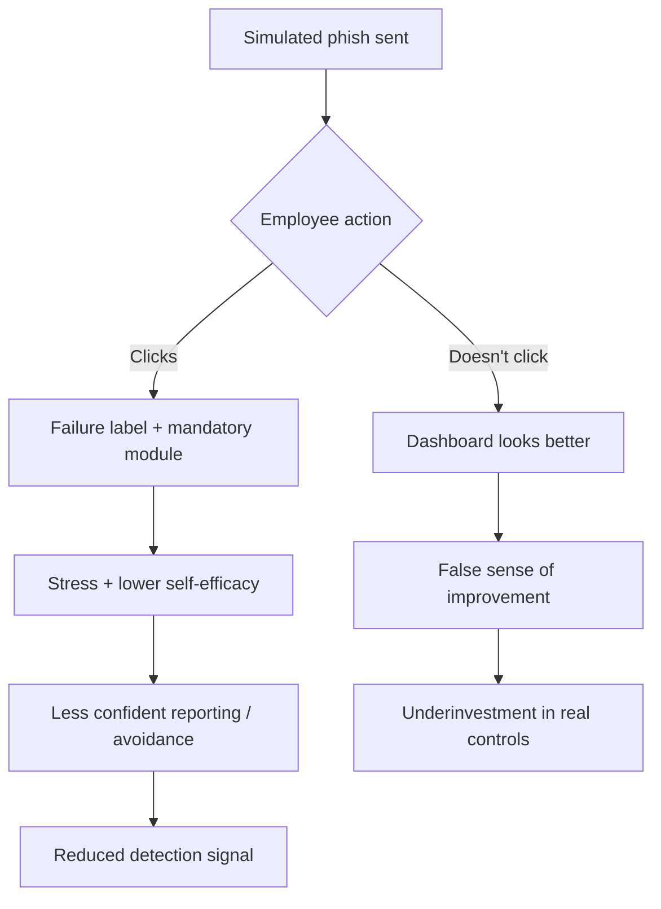
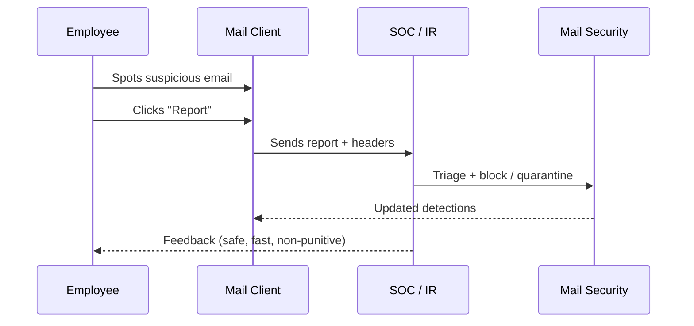

<a href="https://casa.rub.de/en/research/publications/author/m-angela-sasse"
   style="font-family:'Noto Sans', system-ui, -apple-system, Segoe UI, Roboto, Arial, sans-serif;
          font-weight:200; font-size:0.85rem; color:#8a8f98; text-decoration:none;">
   
    Reading list: M. Angela Sasse (Human-Centred Security)
  
</a>

Simulated phishing campaigns (SPCs) are often treated as a *cheap behavioral control*: send fake phish, measure clicks, “train” those who fail.
Human‑centred security research argues this framing is backwards: **users are not the enemy**—security outcomes depend on systems, incentives, and trust, not “catching people out”.[^adams1999]

---

## The core problem: SPCs optimize *click-rate theater*, not resilience

Click rate is an attractive KPI because it’s simple and trends downward over time. But that trend is a weak proxy for whether the organization is safer.

- **Non-click ≠ detection.** People may ignore emails for unrelated reasons, or learn to avoid interacting with anything “weird.”[^lain2021]
- **A “don’t click” culture can suppress reporting.** When staff fear embarrassment or punishment, they delay or avoid escalating near-misses—reducing the organization’s early warning capability.[^brunken2023]
- **Phishing is largely an attention problem.** More content and more enforcement doesn’t reliably fix attention under load.[^lain2024]

---

## Failure-based training has measurable side effects

A large field study co-authored by Sasse measured employees immediately after interacting with a simulated phish:

- Employees who **clicked** reported **higher perceived stress** and **lower phishing self‑efficacy** than those who **reported** the email.[^schops2024]
- Stress is not a “teachable moment” freebie—stress can impair learning and degrade performance, especially when compounded over time.[^schops2024]

That’s the wrong direction for an organization trying to build *competence* and *fast reporting*.

---

## The hidden costs are real (and usually unbudgeted)

SPCs are also sold as low-effort. A procurement case study (again co-authored by Sasse) shows the opposite:

- The selection and rollout can span **>1 year** and involve many stakeholder groups, with substantial “hassle factor” and organizational friction.[^brunken2023]
- Many organizations end up buying platforms to obtain KPIs, even when expected benefits are vague.[^brunken2023]

If your outcome is “better charts,” not “faster detection and containment,” you’ve optimized the wrong system.

---

## What to do instead: treat employees as sensors, not targets

Human‑centred security work emphasizes designing secure routines and removing blockers, rather than scaring or tricking people into compliance.[^sasse_reboot][^sasse2015]

### Practical moves that improve security outcomes

1) **Make reporting effortless**
- A one-click *Report phishing* button, fast feedback, and non-punitive handling improves collective detection signal.[^lain2021]

2) **Measure what matters**
- Track **time-to-report**, **report rate**, and **triage accuracy**, not just click rate.[^lain2021]

3) **Fix the boundary conditions**
- Reduce the blast radius with MFA, least privilege, safer attachment handling, and strong email authentication—controls that don’t depend on perfect attention.

---

## Final word

The recipe is clear: security improves when you **reduce friction**, **raise self‑efficacy**, and **align incentives**! Not when you run “gotcha” exercises.
If SPCs are your primary lever, you’re likely optimizing dashboards while weakening trust and suppressing the reporting signal you actually need.

Stay safe :) 

---

## References

[^schops2024]: Markus Schöps, Marco Gutfleisch, Eric Wolter, and M. Angela Sasse. “Simulated Stress: A Case Study of the Effects of a Simulated Phishing Campaign on Employees’ Perception, Stress and Self-Efficacy.” *USENIX Security 2024* (PDF). <https://www.usenix.org/system/files/usenixsecurity24-schops.pdf>  
[^brunken2023]: Lina Brunken, Annalina Buckmann, Jonas Hielscher, and M. Angela Sasse. “To Do This Properly, You Need More Resources”: The Hidden Costs of Introducing Simulated Phishing Campaigns. *USENIX Security 2023* (PDF). <https://www.usenix.org/system/files/usenixsecurity23-brunken.pdf>  
[^lain2021]: Daniele Lain, Kari Kostiainen, Srdjan Capkun. “Phishing in Organizations: Findings from a Large-Scale and Long-Term Study.” arXiv:2112.07498 (15-month study; reporting button; embedded training effects). <https://arxiv.org/abs/2112.07498>  
[^lain2024]: Daniele Lain et al. “Content, Nudges and Incentives: A Study on the Effectiveness and Perception of Embedded Phishing Training.” arXiv:2409.01378 (CCS’24 extended version). <https://arxiv.org/abs/2409.01378>  
[^sasse2015]: M. Angela Sasse. “Scaring and Bullying People into Security Won’t Work.” *IEEE Security & Privacy* (2015). (Preprint link). <https://www.cs.ucl.ac.uk/fileadmin/sec/publications/Sasse_scare_security_ieee2np2015.pdf>  
[^sasse_reboot]: M. Angela Sasse, Jonas Hielscher, Jennifer Friedauer, Annalina Buckmann. “Rebooting IT Security Awareness – How Organisations Can Encourage and Sustain Secure Behaviours.” (Open-access PDF via UCL Discovery). <https://discovery.ucl.ac.uk/id/eprint/10173711/>  
[^bada2015]: Maria Bada, Angela M. Sasse, Jason R. C. Nurse. “Cyber Security Awareness Campaigns: Why do they fail to change behaviour?” (PDF). <https://www.cs.ox.ac.uk/files/7194/csss2015_bada_et_al.pdf>  
[^adams1999]: Anne Adams and M. Angela Sasse. “Users are not the enemy.” *Communications of the ACM* (1999). (Accessible copy). <https://www.semanticscholar.org/paper/Users-are-not-the-enemy-Adams-Sasse/168488dc2088dc5a48e7c85e7fd487145d161223>  
