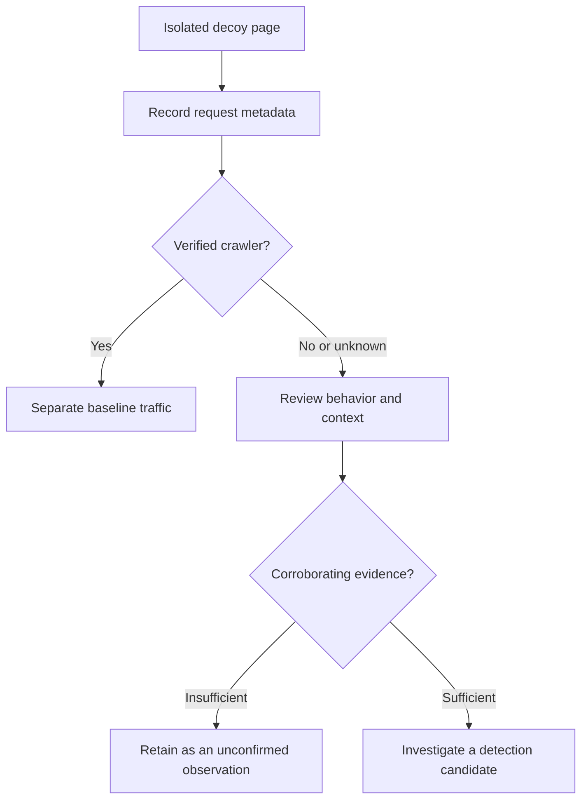

I had a thought the other day that I think is actually pretty cool, so I'm writing it down before I forget.


## The setup

Attackers use Google dorks. You know this. Things like:

```
inurl:"/admin/login.php"
intitle:"index of" "backup.sql"
filetype:env "DB_PASSWORD"
```

The idea is simple: they search for patterns that only vulnerable or misconfigured systems expose. Google does the target discovery for them. It's passive, scalable, and extremely effective.

We spend a lot of energy hardening our systems so they don't show up in those searches. But almost nobody asks the inverse question:

> **What if we built websites specifically designed to show up in those searches?**


## The idea

A dork honeypot is a decoy website constructed to match a known dork query: intentionally indexable, deliberately reachable, and instrumented to record requests. It is a detection hypothesis to test, not a guarantee of traffic or useful intelligence.

The logic is clean:

- You build a page with a URI like `/admin/config.php?debug=true`
- You make sure it's crawlable and indexed
- Someone searches for `inurl:"/admin/config.php?debug=true"` and your page appears in the results
- They click through
- **You log them**

A request to that URI is a lead, not an attribution. Search crawlers, benign scanners, researchers, link previews, and accidental visitors can also reach it. Even the exact search query may be unavailable. The useful question is whether a sequence of requests supports a reconnaissance hypothesis.



---

## Why this could be useful

The attacker's methodology is their weakness here. Dork queries are precise. They're not searching for anything, they're searching for *specific indicators* of misconfiguration or exposure. That precision means you can construct pages that match exactly those indicators, with no organic reason for a normal user to ever land there.

A page that resembles an exposed `.env` file, a forgotten backup endpoint, or an open directory listing can attract traffic relevant to that exposure. Use synthetic content only and keep the decoy isolated from real applications and credentials.

That makes it a useful place to collect observations. Their meaning still needs validation.


## Taking it further: a dork honeypot generator

The natural extension of this is a tool. Something like:

1. You input a dork (e.g., `inurl:"/phpmyadmin/setup" intitle:"phpMyAdmin setup"`)
2. The tool generates a set of pages that satisfy the conditions of that dork (correct URI structure, correct page title, realistic-looking fake content)
3. Those pages are deployed to a domain and submitted to major search engines
4. Every visit is logged with IP, timestamp, referrer, and request headers

More decoys create more coverage to test, but page count alone does not establish search visibility or detection quality. Track which pages are actually indexed, how much baseline traffic they receive, and how often an observation survives review.

For automated recon scripts (tools that take a dork and dump a list of URLs), your honeypot endpoints are just valid targets. They'll get queued, hit, and logged automatically. No interaction required.


## The dashboard concept

The management side of this doesn't need to be complicated. A minimal interface:

- **Input:** paste a dork
- **Output:** generated pages with preview of what gets deployed
- **Logs:** a feed of request paths, timestamps, source IPs, and user-agents, with the intended decoy query recorded separately from the observed referrer. An intended query is not proof of the visitor's actual search.
- **Indexing:** submit a sitemap through Search Console or advertise it in `robots.txt`. Google's old sitemap ping endpoint is deprecated; submission does not guarantee indexing.[^sitemap-ping]
- **Review:** separate verified crawlers, retain confidence and analyst notes, and make uncertainty visible.

Reusing a domain can simplify operations, but ranking and traffic are hypotheses to measure. Begin with a small isolated experiment before increasing the number of pages.


## What you do with the data

That's up to you. A few useful directions:

- **Detection research:** Enrich and correlate observations with other evidence. Avoid automatic blocking or publishing IPs based on one decoy request.
- **Behavioral analysis:** Patterns in request paths and timing may suggest tooling. User-agents are client-supplied claims, and shared IP addresses are not reliable actor identities.
- **Early warning:** Repeated probing can help prioritize investigation, but it does not by itself establish that your organization is being targeted.
- **Deception campaigns:** Fake config files, fake credentials, fake internal documentation. Let them think they found something, and watch what they do with it.


## The honest caveats

Crawler classification needs more than a user-agent string. For Google crawlers, use its published IP ranges or verify reverse DNS and then confirm that the forward lookup resolves to the original address.[^verify-crawlers] Treat unknown traffic as unknown, not automatically hostile.

This isn't a silver bullet. Sophisticated attackers use residential proxies or rotating infrastructure, which makes IP-based attribution noisy. Legal considerations around what you do with the data vary by jurisdiction. And building convincing fake content that actually ranks well takes effort, and search engines have gotten good at identifying thin or fake pages.

But as a layer in a broader threat intel or deception strategy? It's underused. Most honeypots wait passively for attackers to stumble into them. This one reaches out and meets attackers at the exact technique they're already relying on.

---

That's it. I think someone should build it properly. Maybe I will :/

## References

[^sitemap-ping]: Google Search Central. [Sitemaps ping endpoint is going away](https://developers.google.com/search/blog/2023/06/sitemaps-lastmod-ping). Sitemaps can be submitted through Search Console or referenced in `robots.txt`.
[^verify-crawlers]: Google. [Verify requests from Google crawlers and fetchers](https://developers.google.com/crawling/docs/crawlers-fetchers/verify-google-requests). Verification uses published IP ranges or reverse and forward DNS checks.
