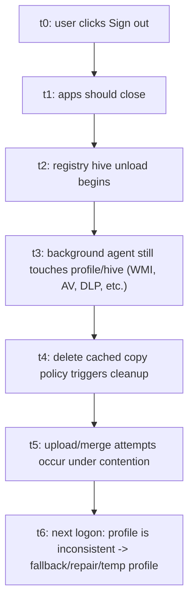
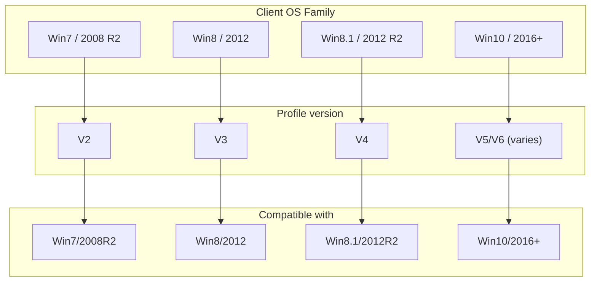
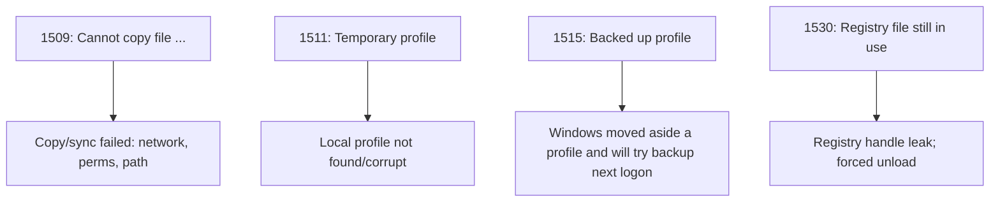
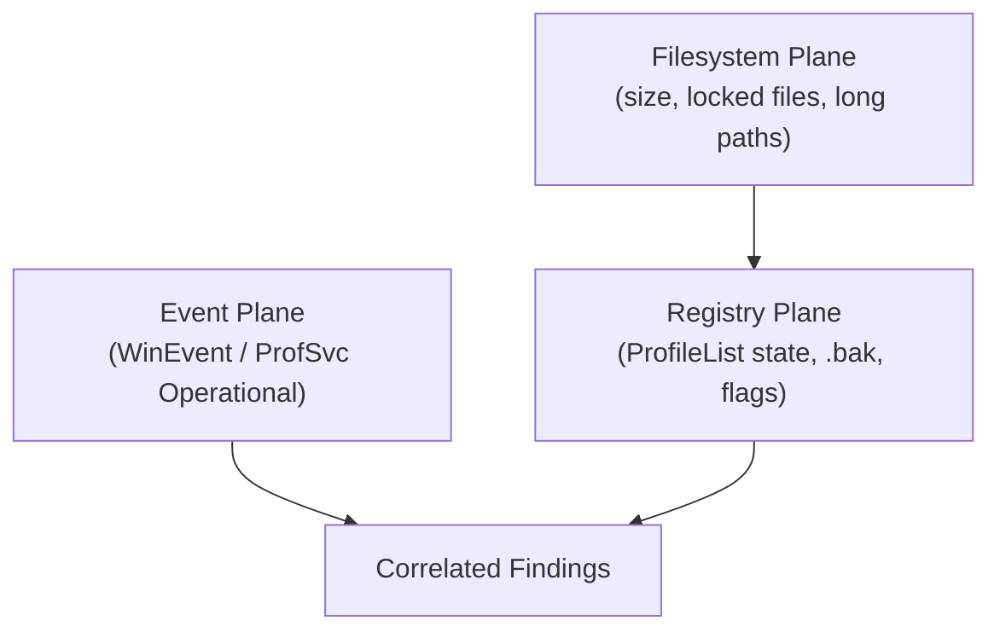
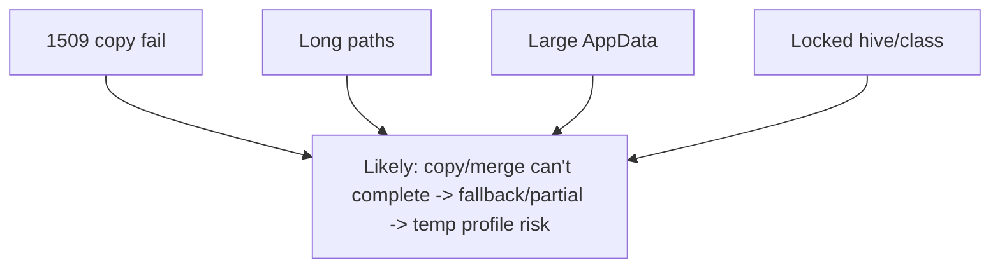

# 🧠 When Windows Profiles Go Rogue  
## A Deep (But Friendly) Technical Dive into Roaming Profile Failure Modes — and How *ProfileDoktor* Diagnoses Them

It’s 08:57. The helpdesk queue is calm. Then 09:03 hits.

> “My desktop is empty.”  
> “Outlook forgot everything.”  
> “I logged in and it says TEMP… again.”  
> “Why does sign‑in take **six minutes**?”

If your environment still uses **Roaming User Profiles (RUP)**, you’ve seen this movie. Roaming profiles were built to make user state portable across domain‑joined machines: settings, registry hives, and that familiar “this is my desktop” feeling. But the mechanism is deceptively simple — copy profile down at logon, merge back at logoff — and the failure surface area is… enormous. [^1]

This article goes **way beyond** “check permissions”:

- We model roaming profiles as a **distributed state synchronization system**
- We map symptoms to **exact failure classes** (network, registry, filesystem, versioning)
- We show how Windows **signals** these failures (events, state flags, temp profile fallbacks)
- We break down how **ProfileDoktor** works internally to detect them efficiently and reproducibly

You’ll get diagrams, examples, and a practical mental model — without assuming you already live in ProcMon.

---

## 1) Roaming Profiles as a Distributed System (Yes, Really)

At an abstract level, a roaming profile is a **replicated dataset**:

- **Authoritative copy:** a profile stored on a server share (SMB path)
- **Working copy:** a local profile folder on each workstation/server where the user logs in
- **Replication events:** logon (server → local) and logoff (local → server merge)

Microsoft’s description captures the gist: the profile loads to the local computer and merges, and on sign‑out the local copy merges with the server copy. [^1]

If we draw it like a distributed system, it looks like this:

```mermaid
flowchart TB
  subgraph SMB["SMB / File Share"]
    server["&#92;&#92;FS01&#92;Profiles&#92;U<br/>server profile"]
  end
  subgraph Local["Local Machine"]
    local["C:&#92;Users&#92;U<br/>local profile<br/>- NTUSER.DAT (HKU&#92;&lt;SID&gt;)<br/>- UsrClass.dat (per-user COM/class store)<br/>- AppData (huge, messy, often cursed)"]
  end
  server -->|logon merge<br/>(download/copy files)| local
  local -->|logoff merge<br/>(upload deltas)| server
```

### Why “distributed system” thinking helps

Distributed systems fail because of:

- **latency / timeouts**  
- **partial failures** (some files copy, others fail)  
- **conflicts** (what changed locally vs. what exists on the server)  
- **inconsistency windows** (user logs off, upload fails, server copy stale)  

Roaming profiles contain all of these failure modes — except your “database” is a directory tree and a registry hive.

---

## 2) The Roaming Profile Pipeline: What *Actually* Happens

Windows profile load/unload is orchestrated by the **User Profile Service** (ProfSvc) and associated components. Operationally, you can observe the flow via the **User Profile Service → Operational** log. Microsoft explicitly recommends using that channel when troubleshooting profile issues. [^2]

### 2.1 Logon pipeline (high‑level)

```mermaid
flowchart TD
  A[User authenticates] --> B[ProfSvc decides profile source]
  B --> C{Local only?}
  C -->|Yes| D[Use existing local profile]
  C -->|No| E{Roaming path configured?}
  E -->|Yes| F[Download/merge from SMB]
  F --> G[Load registry hive: NTUSER.DAT -> HKU&#92;&lt;SID&gt;]
  G --> H[Start shell / userinit]
  E -->|No| D
```



### 2.2 Logoff pipeline (high‑level)

```mermaid
flowchart TD
  A[User logs off] --> B[Apps should close handles]
  B --> C[Unload user hive (NTUSER.DAT)]
  C --> D[Merge/upload local changes to server profile]
  D --> E[Optional: delete cached copy / cleanup]
```

**Important nuance:** the pipeline has phases with different dependencies:

- **Network dependency** spikes at logon/logoff (copy/merge)
- **File locking / registry handle leakage** becomes critical at logoff/unload
- **Versioning/compatibility** influences whether Windows treats the server profile as usable

---

## 3) Why Roaming Profiles Break: Failure Taxonomy

Let’s build a taxonomy you can use like a diagnostic lens.

### 3.1 Network & “slow link” failure class

Roaming profiles are sensitive to network behavior because their core operation is “copy a lot of small files + a couple of large hives.”

Microsoft documents **slow link detection** behavior and its thresholds (download speed and server response time), and a policy to force Windows to wait for the remote profile even on slow links. [^3]

A simplified model:

```
if throughput < threshold OR RTT > threshold:
    treat as slow link
    may skip / degrade remote profile operations
else:
    proceed normally
```

What this looks like to users:
- logons that alternate between “fast” and “forever”
- intermittent partial sync (especially on Wi‑Fi / VPN / congested WAN)
- temp profile fallbacks when the remote path is unreachable at logon

### 3.2 Filesystem failure class (path length, locked files, massive trees)

#### (a) Path length explosions: the “260 char cliff”
A particularly nasty failure occurs when the *remote* path prefix expands the effective full path length beyond legacy limits. Microsoft documents a case where Event ID **1509** triggers because a longer UNC prefix causes the computed destination path to exceed supported length. [^4]

Diagram view of the problem:

```mermaid
flowchart TB
  A["LOCAL path<br/>C:&#92;Users&#92;Alice&#92;AppData&#92;Local&#92;SomeApp&#92;Cache&#92;...&#92;file.tmp<br/>~120 chars"]
  B["REMOTE path (UNC)<br/>&#92;&#92;FS01&#92;ThisIsTheProfileShare&#92;Alice&#92;AppData&#92;Local&#92;SomeApp&#92;Cache&#92;...&#92;file.tmp<br/>~160 chars"]
  A --> B
  B --> C["Now past classic MAX_PATH"]
```



#### (b) File locks & sharing violations
If an application (or filter driver, AV, indexing, etc.) holds a handle open on a profile file, merges can fail. This is especially toxic for registry hive files and per‑user class stores. In the real world, you often need to identify which process has the handle. Microsoft and Sysinternals guidance shows how to use Process Explorer / handle search to find blocking processes. [^5]

#### (c) “Small files” problem
Even when the profile isn’t “large” in MB, it can be huge in **file count**. Thousands of tiny files mean:
- more SMB round‑trips
- more metadata operations
- higher probability of partial failure

Roaming profiles are effectively a worst-case workload for “many small files over the network.”

### 3.3 Registry/hive failure class: the silent killer

The user’s registry hive (**NTUSER.DAT**) is loaded into `HKEY_USERS\<SID>` during logon. If the hive cannot be loaded (corrupt, missing, locked), the profile cannot be used.

Windows also logs warnings when registry handles are leaked by applications at logoff; Event ID **1530** is associated with registry file still in use and Windows forcing unload. Microsoft Q&A notes that this warning occurs because Windows closes handles left open by applications. [^6]

This is why **UPHClean** (User Profile Hive Cleanup Service) historically mattered in server/RDS scenarios: it cleans up leaked registry handles to allow the profile to unload cleanly and sync back. [^7]


### 3.4 Policy‑Induced Corruption: “Delete Cached Copies” and Timing Hazards

Some environments enable the Group Policy **“Delete cached copies of roaming profiles”** to reduce disk usage and limit data persistence on shared machines (common on RDS/VDI or kiosk-like endpoints). The tradeoff is brutal: you’re effectively turning every logoff into a *hard requirement* that the profile unload, sync, and clean up cleanly — every time.

Microsoft has documented scenarios where roaming profiles are corrupted in Remote Desktop Services environments when monitoring software performs WMI queries *and* cached copies are deleted at logoff — a reminder that profile reliability is not only about “the user,” but also about the ecosystem of agents running in-session and at logoff. [^13]

A useful mental model is a **race condition** at logoff:



When people say “roaming profiles are flaky,” this is often what they mean: the system is correct **only if everyone behaves** at exactly the right time.

### 3.5 Filter Drivers and “Invisible Hands” in the IO Path

Most profile failures look like “Windows couldn’t copy file X.” What’s missing from that message is *who else is in the pipeline*.

In enterprise endpoints, the profile IO path is commonly intercepted by:

- Antivirus / EDR scanning (on open, on write, on close)
- DLP agents watching user data
- Indexing services and backup agents
- Encryption layers and redirection drivers

These components can introduce:
- transient file locks (sharing violations)
- delayed close semantics
- access denied outcomes that are policy-driven, not user-driven

This is why a single Event 1509 can be misleading: it’s often *symptomatic*, not *causal*. Use it as a starting point, then correlate.

### 3.6 DFS Namespaces, Referrals, and “Same UNC, Different Reality”

Many orgs present profile shares via **DFS namespaces** so the profile path stays stable while storage backends change.

That’s good design — until:
- referrals shift mid-session
- a target becomes unreachable
- a user hits different backends across logons due to site topology changes

In practice this can manifest as:
- “sometimes the profile is there, sometimes it’s not”
- “some machines load settings, others don’t”
- duplicated directories due to backend divergence

Even with a stable UNC, the system underneath may not be stable.


---

## 4) Versioning and Cross‑OS Compatibility: Why “Same User” ≠ “Same Profile”

One of the most underappreciated roaming profile problems is **profile versioning**. Windows uses different profile formats across versions; if you roam across mixed OS versions, you can end up with parallel profiles (e.g., `.V2`, `.V5`, `.V6`) or compatibility rejections.

Microsoft documents both:
- roaming profile incompatibilities between OS generations [^8]
- and roaming profile versioning behavior and its implications [^9]

A simplified compatibility diagram (illustrative):



**What the user sees:**  
- “My settings don’t roam” (because they’re roaming… to the *other* versioned profile)  
- duplicate server profile directories  
- random logon resets when the wrong profile format is selected

---

## 5) Observability: How Windows Tells You What’s Wrong

### 5.1 The logs that matter (and why)

Microsoft’s troubleshooting guidance points you to the **User Profile Service Operational** log and correlating events around the time of failure. [^2] You typically correlate:

- **User Profile Service/Operational**  
- **Application** and **System** logs (secondary evidence)  
- **Security** log for logon events (e.g., **4624**) to tie failures to exact sessions

### 5.2 Event ID cheat sheet (practical, not exhaustive)



Microsoft provides detail on Event 1509 scenarios and resolutions (including path length related causes). [^10] For “temporary profile” patterns, Microsoft support/community threads often point to the same operational log and event IDs as first‑line evidence. [^11]

---

## 6) Enter *ProfileDoktor*: Diagnosis as a Repeatable Pipeline

Here’s where your automation tool becomes powerful: it treats profile troubleshooting as a **repeatable, evidence‑driven pipeline**, not a “hunt through GUIs.”

### 6.1 The three diagnostic lenses

ProfileDoktor inspects three planes of evidence:



### 6.2 Filesystem Plane: detecting the “physics” of failure

ProfileDoktor recursively inventories profile files, computing:
- total file count/bytes
- roaming‑relevant file count/bytes (optionally excluding patterns)
- large files above a threshold
- long paths ≥ 260 characters
- missing core files such as `NTUSER.DAT` and `UsrClass.dat`
- locked-file candidates by attempting an exclusive open

Internally, the lock test uses `System.IO.File::Open(..., FileShare.None)` to detect sharing violations. [^PD1]

**A subtle but important detail:** ProfileDoktor doesn’t just look for “any file.” It explicitly checks for **core profile artifacts** whose absence often implies a broken or incomplete local profile initialization (or a failed prior sync):

- `NTUSER.DAT` plus its transaction logs (`NTUSER.DAT.LOG1`, `NTUSER.DAT.LOG2`)
- `AppData\Local\Microsoft\Windows\UsrClass.dat` (per-user class store)

It also prioritizes lock checks on hive/class-store files and selected extensions, because these are disproportionately likely to block profile load/unload operations. [^PD1]


That mechanism directly maps to real failure causes (locked hive / locked class store), which are known to produce profile load/sync issues. [^5][^6]

### 6.3 Event Plane: correlating the right events to the right user

Instead of dumping “all profile events,” ProfileDoktor filters logs within a time window and checks whether each event matches the user by:
- SID match (`Event.UserId`)
- SID fields inside EventData
- account/domain fields inside EventData
- message text fallback (last resort)

This multi-strategy correlation is implemented explicitly and avoids the classic pitfall: “I found an error, but I’m not sure it’s for *this* user.” [^PD2]

Under the hood, it converts each event to XML (`EventRecord.ToXml()`), builds a **name → value map** of `EventData` fields, and then tests a cascade of match strategies (UserId SID match → EventData SID fields → username/domain fields → message fallback). That approach is resilient across providers that populate different field names, and it’s one of the main reasons the report stays “about the user you asked for,” not “whatever happened around the same time.” [^PD2]


It pulls from:
- `Microsoft-Windows-User Profile Service/Operational`
- `Application`
- `System`  
and uses `Security` log **4624** to report last logon context. [^PD2]

### 6.4 Registry Plane: the `.bak` and state-story

A common temp-profile story involves ProfileList keys being renamed with a `.bak` suffix, and Windows logging the user into a temporary profile. Multiple guides reference `.bak` keys under:

`HKLM\SOFTWARE\Microsoft\Windows NT\CurrentVersion\ProfileList`

as part of diagnosing/remediating these cases. [^12]

ProfileDoktor checks for `.bak` presence and includes that evidence in its report, alongside ProfileList state/flags/refcount metadata for context. [^PD3]

### 6.5 Output: a report that’s actually readable

The tool generates an HTML report with:
- per-user navigation links
- sections for overview, logon context, registry state, inventory findings
- a summary of events and “last sync success/failure” timestamps derived from events

This is not just convenience: it transforms raw forensic data into an artifact you can:
- attach to a ticket  
- paste into a postmortem  
- compare across machines/users over time  

[^PD4]

---

## 7) A Worked Example: Reading Symptoms Like a Forensic Story

Let’s walk a scenario end-to-end. (Example data below is illustrative.)

### 7.1 Symptom

> “I log in and it takes a long time. Sometimes I get TEMP.”

### 7.2 Evidence pattern

- ProfSvc Operational log shows repeated 1509 copy failures
- File inventory shows several paths ≥ 260 chars
- Large file list shows multi‑GB cache under AppData
- Locked candidates include `UsrClass.dat`

Failure fingerprint diagram:



### 7.3 Concrete action steps (what you do next)

1) If **long paths** dominate:
- shorten share name / profile root
- reduce deep-nesting paths (often in AppData)
- consider excluding volatile cache directories

This maps directly to Microsoft’s documented 1509 cause involving path growth over the supported limit. [^4]

2) If **locks** dominate:
- identify process holding handle (Process Explorer “Find Handle”)
- remediate misbehaving app/service/AV exclusions

Microsoft/Sysinternals guidance describes this handle-search workflow. [^5]

3) If **slow link** dominates:
- tune slow link detection / policies so Windows waits for remote profile when desired
- avoid roaming over high-latency links if you can

Microsoft documents the slow link behavior and policy choices. [^3]

---

## 8) Engineering Notes: Why This Tool Looks “Enterprise”

Recruiters often read PowerShell tools as “a bunch of cmdlets.” This one is more than that. Architecturally, ProfileDoktor demonstrates:

- **Deterministic correlation logic** (SID + EventData + message fallback)  
- **Multiple evidence planes** (events + filesystem + registry)  
- **Safety-aware IO** (file-share exclusive open as a lock probe)  
- **Report generation** as an operational artifact  

That combination is what makes it useful: it doesn’t just “scan,” it builds **diagnostic certainty**.

---

## 9) Mini Glossary (Advanced Terms, Plain Explanations)

- **ProfSvc (User Profile Service):** Windows service that loads/unloads user profiles and hives.
- **Hive (NTUSER.DAT):** File storing the user registry; loaded into `HKEY_USERS\<SID>`.
- **SID:** Security Identifier, a unique identity token for Windows accounts; better than names for correlation.
- **Operational log:** A detailed event channel for a Windows component; for profiles, `User Profile Service/Operational`. [^2]
- **Slow link detection:** Windows heuristics to decide if network is “too slow” for full policy/profile operations. [^3]
- **.bak ProfileList key:** A ProfileList registry key that’s been backed up/renamed; commonly seen in temp profile incidents. [^12]

---

## 10) Closing: The Real Superpower Is Repeatability

Roaming profiles fail in ways that are:
- intermittent  
- multi-causal  
- hard to reproduce on demand  

That’s exactly the kind of problem where automation shines. *ProfileDoktor* turns a messy, high-variance troubleshooting process into a structured audit with evidence, correlation, and a reportable outcome — the difference between “I think it’s permissions” and “Here’s the exact locked hive + the events + the long paths that made sync fail.”

---

## References

[^1]: Microsoft. “Folder Redirection and Roaming User Profiles in Windows.” *Microsoft Learn*, May 15, 2025. Accessed Jan 30, 2026. https://learn.microsoft.com/en-us/windows-server/storage/folder-redirection/folder-redirection-rup-overview  
[^2]: Microsoft. “Troubleshoot user profiles with events.” *Microsoft Learn*, Jan 15, 2025. Accessed Jan 30, 2026. https://learn.microsoft.com/en-us/troubleshoot/windows-server/user-profiles-and-logon/troubleshoot-user-profiles-events  
[^3]: Microsoft. “Manage User Profile Service slow link detection.” *Microsoft Learn*, Jan 15, 2025. Accessed Jan 30, 2026. https://learn.microsoft.com/en-us/troubleshoot/windows-server/user-profiles-and-logon/manage-profile-service-slow-link-detection  
[^4]: Microsoft. “User profile cannot be loaded with Event ID 1509: DETAIL (path length).” *Microsoft Support*, Jan 15, 2025. Accessed Jan 30, 2026. https://support.microsoft.com/help/2536571/user-profile-cannot-be-loaded-with-event-id-1509-detail-the-filename-o  
[^5]: Microsoft. “Identify which process is blocking a file in Windows.” *Microsoft TechCommunity (IT Ops Talk)*, Jul 12, 2025. Accessed Jan 30, 2026. https://techcommunity.microsoft.com/blog/itopstalkblog/identify-which-process-is-blocking-a-file-in-windows/4432635  
[^6]: Microsoft. “EventID: 1530 User registry handles leaked.” *Microsoft Q&A*, Nov 9, 2020. Accessed Jan 30, 2026. https://learn.microsoft.com/en-us/answers/questions/155068/eventid-1530-user-registry-handles-leaked  
[^7]: Payne, J. “What’s User Profile Hive Cleanup Service (UPHClean)?” *ITPro Today*, 2004. Accessed Jan 30, 2026. https://www.itprotoday.com/windows-8/what-s-user-profile-hive-cleanup-service-uphclean-  
[^8]: Microsoft. “Incompatibility between Windows 8 roaming user profiles and roaming profiles in other versions of Windows.” *Microsoft Support*, (updated). Accessed Jan 30, 2026. https://support.microsoft.com/en-us/topic/incompatibility-between-windows-8-roaming-user-profiles-and-roaming-profiles-in-other-versions-of-windows-994c2a2b-ad21-60da-e9ac-a0149513956a  
[^9]: Microsoft. “Roaming user profiles versioning.” *Microsoft Learn*, (KB 3056198). Accessed Jan 30, 2026. https://learn.microsoft.com/en-us/troubleshoot/windows-server/user-profiles-and-logon/roaming-user-profiles-versioning  
[^10]: Microsoft. “User profile cannot be loaded with Event ID 1509.” *Microsoft Learn*, Jan 15, 2025. Accessed Jan 30, 2026. https://learn.microsoft.com/en-us/troubleshoot/windows-server/user-profiles-and-logon/user-profile-cannot-loaded-event-1509  
[^11]: Microsoft. “Temporary Profiles on a Domain (event IDs 1509/1511/1515/1518 checklist).” *Microsoft Learn Q&A*, Apr 8, 2025. Accessed Jan 30, 2026. https://learn.microsoft.com/en-us/answers/questions/2244999/temporary-profiles-on-a-domain  
[^12]: Quest. “Event ID 1511 - You have been logged on with a temporary profile.” *Quest Support KB*, Nov 20, 2012. Accessed Jan 30, 2026. https://support.quest.com/de-de/kb/100496/event-id-1511-you-have-been-logged-on-with-a-temporary-profile  
[^13]: Microsoft. “Roaming user profiles are corrupted when a monitoring program executes a WMI query on a Windows Server 2008 R2 SP1-based RDS server.” *Microsoft Support*, (article). Accessed Jan 30, 2026. https://support.microsoft.com/en-us/topic/roaming-user-profiles-are-corrupted-when-a-monitoring-program-executes-a-wmi-query-on-a-windows-server-2008-r2-sp1-based-rds-server-84a20eac-0676-43d5-b935-69f2eff6ce19  

## ProfileDoktor source references (tool internals)

[^PD1]: 0xhmza. “ProfileDoktor.ps1 — Test-FileLocked uses exclusive open (FileShare.None).” *GitHub Raw*, accessed Jan 30, 2026. https://raw.githubusercontent.com/0xhmza/Profile-Doktor/refs/heads/main/ProfileDoktor.ps1  
[^PD2]: 0xhmza. “ProfileDoktor.ps1 — Event correlation across ProfSvc Operational/Application/System + Security 4624.” *GitHub Raw*, accessed Jan 30, 2026. https://raw.githubusercontent.com/0xhmza/Profile-Doktor/refs/heads/main/ProfileDoktor.ps1  
[^PD3]: 0xhmza. “ProfileDoktor.ps1 — Registry state/reporting (ProfileList, .bak detection).” *GitHub Raw*, accessed Jan 30, 2026. https://raw.githubusercontent.com/0xhmza/Profile-Doktor/refs/heads/main/ProfileDoktor.ps1  
[^PD4]: 0xhmza. “ProfileDoktor.ps1 — HTML report generation & per-user sections.” *GitHub Raw*, accessed Jan 30, 2026. https://raw.githubusercontent.com/0xhmza/Profile-Doktor/refs/heads/main/ProfileDoktor.ps1  
