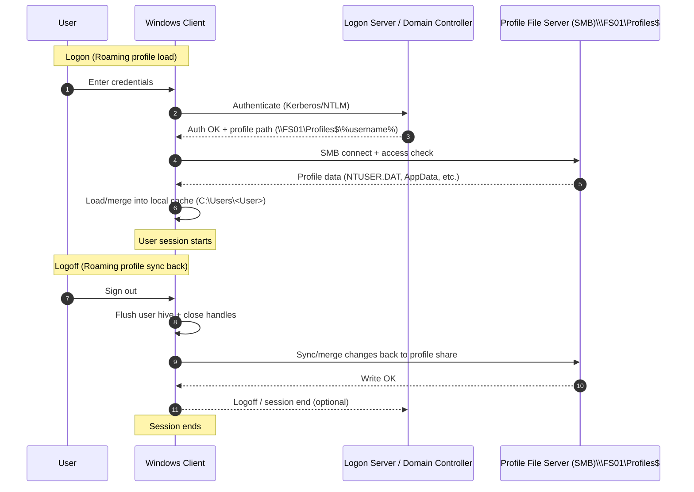

**ProfileDoktor** is a **PowerShell 5.1+** auditing tool for Windows user profiles that helps administrators triage *roaming-profile–adjacent* problems (slow sign‑in/sign‑out, temporary profiles, copy failures, profile state drift) by consolidating the most relevant evidence into a single **HTML report**.

It replaces the familiar "open Event Viewer, then regedit, then File Explorer, then WMI" loop with a repeatable, scriptable workflow. Particularly useful on shared workstations, legacy Active Directory estates, and Remote Desktop Services (RDS) hosts where roaming profiles are still very much a daily reality.


## Background and motivation

**Roaming User Profiles (RUP)** give users a consistent desktop and application experience across machines by hosting the profile on a file share and synchronizing it at sign‑in and sign‑out.[^ms-rup-overview] That synchronization chain is sensitive to network quality, filesystem behavior, and registry hive load/unload mechanics, so when things go wrong, they tend to present as:

- **temporary profiles**, missing settings, or repeated "first logon" experiences,
- **slow sign‑in / sign‑out** from copy and merge overhead,
- **intermittent issues** that vanish on the next session (race conditions, slow link decisions, transient locks).

ProfileDoktor's value is not "magic repair." It's fast evidence gathering in a format you can hand to another admin or attach to a ticket.


## How roaming profiles work in Windows

Roaming profiles are orchestrated by the **User Profile Service** (`ProfSvc`), which owns the loading and unloading of user profiles.[^ms-profsvc]

### Synchronization boundary

The core model is straightforward:

- at sign‑in, the profile **loads to the local computer**, merging with an existing local copy if one is present,
- at sign‑out, the local copy **merges back** to the server copy.[^ms-rup-overview]


### Cached profiles and slow link detection

Windows uses **slow link detection** to decide whether to download the roaming profile at sign‑in. When the link is deemed too slow, Windows can skip the download entirely and load the **local cached copy** instead, logging an event to record the decision.[^ms-slowlink] This is one of the more common reasons two sessions behave differently for the same user on the same workstation.

### Profile versioning and OS upgrades

Roaming profile formats differ across Windows releases. When a user signs in on a version that uses a different profile format, they may receive a **new empty roaming profile**, and Microsoft documents no supported migration path between profile versions.


## Failure modes ProfileDoktor is built to highlight

Profile failures are rarely a single bug. They're usually emergent behavior from timing, I/O, and accumulated state.

### 1) File copy and path-length failures

The Win32 path length constant `MAX_PATH` is defined as **260 characters** for most APIs and toolchains, with some exceptions and opt-ins.[^ms-maxpath] A long server UNC prefix combined with a local destination path can exceed that limit, resulting in profile copy failures with the familiar "filename or extension is too long" error, documented by Microsoft under Event **1509**.[^ms-event1509]

### 2) Temporary profiles and ProfileList drift

A recurring pattern in temporary profile incidents is inconsistent state under:

`HKLM\SOFTWARE\Microsoft\Windows NT\CurrentVersion\ProfileList`

Microsoft's own profile hygiene scripts treat `.bak` entries in `ProfileList` as a warning condition, as they frequently appear alongside profile load failures and duplicated profile records.[^ms-temp-profile-script]

### 3) Registry hive unload friction

A user profile includes a registry hive (`NTUSER.DAT`) that loads at logon and maps to `HKEY_CURRENT_USER`.[^ms-about-profiles] If processes hold handles open, the hive can be slow or messy to unload. Microsoft notes that **User Profile Service event 1530** ("registry file is still in use") is often safe to ignore, but it remains useful telemetry when correlating sign‑out delays with endpoint agents or applications that leak handles.[^ms-troubleshoot-events]


## What ProfileDoktor collects

ProfileDoktor pulls evidence from several sources and compiles it into a single HTML report.

### Data sources

- **WMI/CIM**:
  - `Win32_UserProfile` (profile inventory)[^ms-win32-userprofile]
  - `Win32_LogicalDisk`, `Win32_OperatingSystem`, `Win32_ComputerSystem`
- **Registry**: `HKLM:\SOFTWARE\Microsoft\Windows NT\CurrentVersion\ProfileList`
- **Event logs**:
  - `Microsoft-Windows-User Profile Service/Operational`
  - `Application`, `System`
  - `Security` (successful logon **4624** to infer logon server and context)[^ms-event4624]

The README also lists the full set of event IDs scanned, including 1509 and 1530, among others.

### Reporting

Output is a comprehensive HTML report, saved next to the script by default or to a path specified with `-OutputPath`. Reading the Security log requires appropriate access if you want 4624 context included.


## Quick start

Run in an elevated PowerShell session:
```powershell
# Scan all local profiles
.\ProfileDoktor.ps1 -AllUsers

# Scan one user (DOMAIN\user or user@domain)
.\ProfileDoktor.ps1 -UserName "CONTOSO\jdoe"

# Write to a custom file and skip the browser prompt
.\ProfileDoktor.ps1 -AllUsers -OutputPath ".\ProfileDoktor.html" -NoPrompt
```

### Requirements

- PowerShell **5.1+**
- Windows **10/11** or Windows Server **2016+**
- Optional: **ActiveDirectory** module (enriches `ProfilePath` and `HomeDirectory` when present)
- Note: reading Security log data requires appropriate access

### Key parameters

| Parameter | Purpose | Default |
|---|---|---|
| `-UserName` | Scan one user (DOMAIN\user or user@domain) | none |
| `-AllUsers` | Scan all local profiles | true |
| `-OutputPath` | HTML output path | current folder |
| `-DaysBack` | Event lookback window | 30 |
| `-LargeFileMB` | Large-file threshold | 50 |
| `-TopFileCount` | Top N large/locked/long paths | 25 |
| `-MaxEvents` | Per-log event cap | 2000 |
| `-NoPrompt` | Don't ask to open the report | false |


## References

[^ms-rup-overview]: Microsoft Learn, "Folder Redirection and Roaming User Profiles in Windows and Windows Server." <https://learn.microsoft.com/en-us/windows-server/storage/folder-redirection/folder-redirection-rup-overview>  
[^ms-slowlink]: Microsoft Learn, "Managing Profile Service slow link detection." <https://learn.microsoft.com/en-us/troubleshoot/windows-server/user-profiles-and-logon/manage-profile-service-slow-link-detection>  
[^ms-profsvc]: Microsoft Learn, "Security guidelines for disabling system services in Windows Server" (User Profile Service / ProfSvc). <https://learn.microsoft.com/en-us/windows-server/security/windows-services/security-guidelines-for-disabling-system-services-in-windows-server>  
[^ms-troubleshoot-events]: Microsoft Learn, "Troubleshoot user profiles with events." <https://learn.microsoft.com/en-us/troubleshoot/windows-server/user-profiles-and-logon/troubleshoot-user-profiles-events>  
[^ms-event1509]: Microsoft Learn, "User profile cannot be loaded with Event ID 1509: DETAIL - The filename or extension is too long." <https://learn.microsoft.com/en-us/troubleshoot/windows-server/user-profiles-and-logon/user-profile-cannot-loaded-event-1509>  
[^ms-maxpath]: Microsoft Learn, "Maximum Path Length Limitation." <https://learn.microsoft.com/en-us/windows/win32/fileio/maximum-file-path-limitation>  
[^ms-temp-profile-script]: Microsoft Learn, "Scripts: Clean up profile folder information and prevent TEMP user profiles from being created." <https://learn.microsoft.com/en-us/troubleshoot/windows-server/support-tools/scripts-to-cleanup-profile-folder-information-and-prevent-temp-user-profiles-from-being-created>  
[^ms-about-profiles]: Microsoft Learn, "About User Profiles (Windows)." <https://learn.microsoft.com/en-us/previous-versions/windows/desktop/legacy/bb776892(v=vs.85)>  
[^ms-win32-userprofile]: Microsoft Learn, "Win32_UserProfile class (Windows)." <https://learn.microsoft.com/en-us/previous-versions/windows/desktop/legacy/ee886409(v=vs.85)>  
[^ms-event4624]: Microsoft Learn, "4624(S): An account was successfully logged on." <https://learn.microsoft.com/en-us/previous-versions/windows/it-pro/windows-10/security/threat-protection/auditing/event-4624>