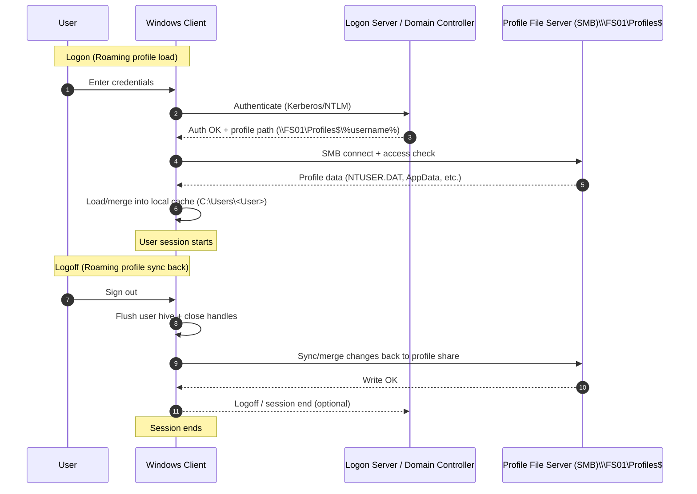

# ProfileDoktor 
<a href="https://github.com/0xhmza/Profile-Doktor"
   style="font-family:'Noto Sans', system-ui, -apple-system, Segoe UI, Roboto, Arial, sans-serif;
          font-weight:200; font-size:0.85rem; color:#8a8f98; text-decoration:none;">
   <span style="text-decoration:underline; text-underline-offset:2px; text-decoration-color:#c9cdd3;">
    Repository: github.com/0xhmza/Profile-Doktor
  </span>
</a>

**ProfileDoktor** is a **PowerShell 5.1+** auditing tool for Windows user profiles that helps administrators triage *roaming-profile–adjacent* problems (slow sign‑in/sign‑out, temporary profiles, profile copy failures, and profile state drift) by consolidating the most relevant evidence into a single **HTML report**.

It’s designed to replace ad‑hoc “open Event Viewer + regedit + file explorer + WMI” troubleshooting with a repeatable, scriptable workflow—especially on shared workstations, legacy Active Directory estates, and Remote Desktop Services (RDS) hosts where roaming profiles are still operationally relevant.

---

## Background and motivation

**Roaming User Profiles (RUP)** exist to provide a consistent desktop and application experience across multiple computers by hosting the profile on a file share and synchronizing it at sign‑in/sign‑out.[^ms-rup-overview] That synchronization chain is sensitive to network quality, filesystem behavior, and registry hive load/unload mechanics—so failures often present as:

- **temporary profiles**, missing settings, or repeated “first logon” experiences,
- **slow sign‑in / sign‑out** (copy/merge overhead),
- **intermittent** issues that disappear on the next session (race conditions, slow link decisions, transient locks).

ProfileDoktor’s value is not “magic repair.” It’s **fast evidence gathering** in a format you can hand to another admin or attach to a ticket.

---

## How roaming profiles work in Windows

Roaming profiles are orchestrated by the **User Profile Service** (`ProfSvc`), which is responsible for **loading and unloading user profiles**.[^ms-profsvc]

### Synchronization boundary

Microsoft’s current overview describes the core model as:

- when a user signs in, the profile **loads to the local computer** (merging with an existing local copy if present),
- when the user signs out, the local copy **merges back** to the server copy.[^ms-rup-overview]



### Cached profiles and slow link detection

Windows can use **slow link detection** to decide whether to download the roaming profile at sign‑in. If the link is determined to be slow, Windows can **skip the download** and load the **local cached copy** instead (and record an event).[^ms-slowlink]

This is a common reason why two sessions can behave differently even for the same user and same workstation.

### Profile versioning and OS upgrades

Roaming profile formats differ across Windows releases. Microsoft documents that when a user signs in on a Windows version that uses a different profile version, they can receive a **new empty roaming profile**, and there is **no supported method** to migrate roaming user profiles between profile versions.

---

## Failure modes ProfileDoktor is built to highlight

Profile failures are rarely “one bug.” They’re usually emergent behavior from timing, I/O, and state.

### 1) File copy and path-length failures

The Win32 path length constant `MAX_PATH` is defined as **260 characters** for many APIs/toolchains (with exceptions and opt‑ins).[^ms-maxpath] Microsoft documents Event **1509** cases where a long server UNC prefix + local destination path can exceed supported lengths, leading to profile copy failures with “filename or extension is too long.”[^ms-event1509]

### 2) Temporary profiles and ProfileList drift

A recurring pattern in “temporary profile” incidents is inconsistent state under:

`HKLM\SOFTWARE\Microsoft\Windows NT\CurrentVersion\ProfileList`

Microsoft’s own profile hygiene scripts treat `.bak` `ProfileList` entries as a warning condition, because they frequently accompany profile load failures and duplicated profile records.[^ms-temp-profile-script]

### 3) Registry hive unload friction

A user profile includes a registry hive (`NTUSER.DAT`) that loads at logon and maps to `HKEY_CURRENT_USER`.[^ms-about-profiles] If processes keep handles open, the hive can be slow or messy to unload. Microsoft notes that **User Profile Service event 1530** (“registry file is still in use”) can often be safely ignored—but it’s still useful telemetry when correlating sign‑out delays with endpoint agents or apps that leak handles.[^ms-troubleshoot-events]

---

## What ProfileDoktor collects

ProfileDoktor collects evidence from multiple “planes” and compiles it into a single HTML report:

### Data sources

- **WMI/CIM**:
  - `Win32_UserProfile` (profile inventory)[^ms-win32-userprofile]
  - `Win32_LogicalDisk`, `Win32_OperatingSystem`, `Win32_ComputerSystem`
- **Registry**: `HKLM:\SOFTWARE\Microsoft\Windows NT\CurrentVersion\ProfileList`
- **Event logs**:
  - `Microsoft-Windows-User Profile Service/Operational`
  - `Application`, `System`
  - `Security` (successful logon **4624** to infer logon server/context)[^ms-event4624]

The README also lists the **event IDs** it scans (including 1509 and 1530, among others).

### Reporting

- Output is a **comprehensive HTML report** (saved next to the script by default, or to `-OutputPath`).
- Security log access is required if you want the report to include 4624 context.

---

## Quick start

Run in an elevated PowerShell session:

```powershell
# Scan all local profiles
.\ProfileDoktor.ps1 -AllUsers

# Scan one user (DOMAIN\user or user@domain)
.\ProfileDoktor.ps1 -UserName "CONTOSO\jdoe"

# Write to a custom file and skip the browser prompt
.\ProfileDoktor.ps1 -AllUsers -OutputPath ".\ProfileDoktor.html" -NoPrompt
```

### Requirements

- PowerShell **5.1+**
- Windows **10/11** or Windows Server **2016+**
- Optional: **ActiveDirectory** module (enriches `ProfilePath` / `HomeDirectory` when present)
- Note: reading Security log data requires appropriate access.

### Key parameters

| Parameter | Purpose | Default |
|---|---|---|
| `-UserName` | Scan one user (DOMAIN\user or user@domain) | none |
| `-AllUsers` | Scan all local profiles | true |
| `-OutputPath` | HTML output path | current folder |
| `-DaysBack` | Event lookback window | 30 |
| `-LargeFileMB` | Large-file threshold | 50 |
| `-TopFileCount` | Top N large/locked/long paths | 25 |
| `-MaxEvents` | Per-log event cap | 2000 |
| `-NoPrompt` | Don’t ask to open the report | false |

---

## References

[^ms-rup-overview]: Microsoft Learn, “Folder Redirection and Roaming User Profiles in Windows and Windows Server.” <https://learn.microsoft.com/en-us/windows-server/storage/folder-redirection/folder-redirection-rup-overview>  
[^ms-slowlink]: Microsoft Learn, “Managing Profile Service slow link detection.” <https://learn.microsoft.com/en-us/troubleshoot/windows-server/user-profiles-and-logon/manage-profile-service-slow-link-detection>  
[^ms-profsvc]: Microsoft Learn, “Security guidelines for disabling system services in Windows Server” (User Profile Service / ProfSvc). <https://learn.microsoft.com/en-us/windows-server/security/windows-services/security-guidelines-for-disabling-system-services-in-windows-server>  
[^ms-troubleshoot-events]: Microsoft Learn, “Troubleshoot user profiles with events.” <https://learn.microsoft.com/en-us/troubleshoot/windows-server/user-profiles-and-logon/troubleshoot-user-profiles-events>  
[^ms-event1509]: Microsoft Learn, “User profile cannot be loaded with Event ID 1509: DETAIL - The filename or extension is too long.” <https://learn.microsoft.com/en-us/troubleshoot/windows-server/user-profiles-and-logon/user-profile-cannot-loaded-event-1509>  
[^ms-maxpath]: Microsoft Learn, “Maximum Path Length Limitation.” <https://learn.microsoft.com/en-us/windows/win32/fileio/maximum-file-path-limitation>  
[^ms-temp-profile-script]: Microsoft Learn, “Scripts: Clean up profile folder information and prevent TEMP user profiles from being created.” <https://learn.microsoft.com/en-us/troubleshoot/windows-server/support-tools/scripts-to-cleanup-profile-folder-information-and-prevent-temp-user-profiles-from-being-created>  
[^ms-about-profiles]: Microsoft Learn, “About User Profiles (Windows).” <https://learn.microsoft.com/en-us/previous-versions/windows/desktop/legacy/bb776892(v=vs.85)>  
[^ms-win32-userprofile]: Microsoft Learn, “Win32_UserProfile class (Windows).” <https://learn.microsoft.com/en-us/previous-versions/windows/desktop/legacy/ee886409(v=vs.85)>  
[^ms-event4624]: Microsoft Learn, “4624(S): An account was successfully logged on.” <https://learn.microsoft.com/en-us/previous-versions/windows/it-pro/windows-10/security/threat-protection/auditing/event-4624>  
