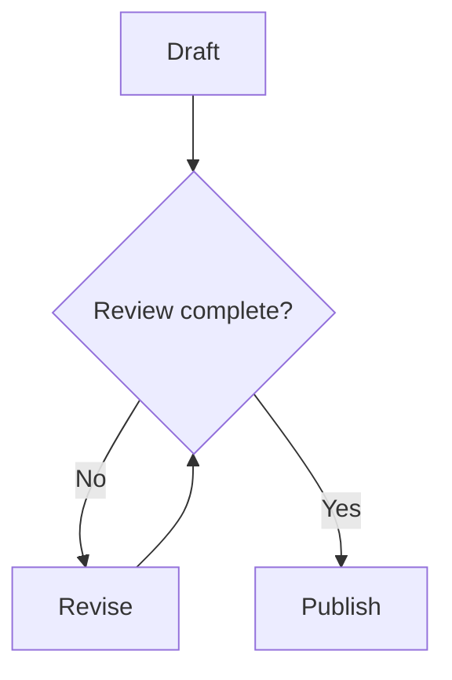

# Diagram methodology

A diagram should answer one question that the surrounding text cannot explain as clearly.

## Choose the right structure

- Use a **flowchart** for transformations, decisions, dependencies, or branching outcomes.
- Use a **sequence diagram** when message order, ownership, or a boundary between actors matters.
- Keep one primary reading direction. Prefer top-to-bottom flow for narrow article columns.
- Split large architectures into an overview and focused details instead of shrinking all the labels.
- Use short, descriptive node labels. Put qualifications in the caption and nearby prose.
- Use solid arrows for the main flow and labeled dashed arrows for configuration or indirect relationships. Explain exceptions in the caption.
- Keep assertions honest: an observation, a hypothesis, and a confirmed result are different states.
- Do not encode meaning through color alone. The renderer owns a shared dark palette.

## Authoring

Ordinary Mermaid fences work automatically. Include a title and a plain-language description:

~~~markdown

~~~

For an explicit caption, capture the source and pass it to the reusable include:

~~~liquid

flowchart TB
  accTitle: Review before publication
  accDescr: Review gates publication, with a revision loop for unfinished work.
  A[Draft] --> B[Review] --> C[Publish]


~~~

Mermaid's [accessibility fields](https://mermaid.js.org/config/accessibility.html) describe the graphic for assistive technology. Every generated figure also exposes the original source. For non-JavaScript readers, the source and any authored caption remain visible.

## Rendering contract

1. The article remains server-rendered HTML.
2. Only pages containing a Mermaid fence or figure load the small local diagram module.
3. An intersection observer requests the pinned [Mermaid Tiny renderer](https://mermaid.js.org/config/usage.html#tiny-mermaid) as a diagram approaches the viewport.
4. Rendering uses strict security mode, plain SVG labels, and the site’s shared dark palette.
5. Work is serialized so diagrams cannot interfere with the renderer’s shared state.
6. Expand moves the existing SVG into a native modal: Escape closes it, focus is contained, and closing restores focus to the triggering button. Zoom and fit accommodate dense diagrams.
7. Failure leaves a readable description and source instead of a blank box.

The tiny renderer supports the current flowcharts and sequence diagrams. Review library support before adding another diagram type; do not add a second renderer just for one figure.

## Review checklist

Check every diagram at a narrow mobile width and in the dark palette. Verify label contrast, complete arrow paths, caption accuracy, source fallback, keyboard access, and the expanded view. Keep complex diagrams horizontally scrollable at readable size rather than compressing their text to fit.
